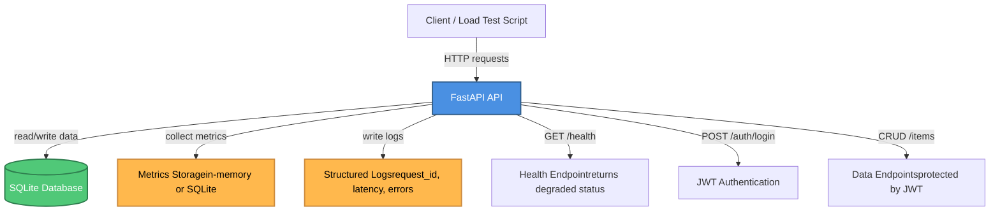

# try2

```mermaid
graph TB
    Client[Client / Load Test Script]
    
    Client -->|HTTP requests| API[FastAPI API]
    
    API -->|read/write data| DB[(SQLite Database)]
    API -->|collect metrics| Metrics[Metrics Storagein-memory or SQLite]
    API -->|write logs| Logs[Structured Logsrequest_id, latency, errors]
    
    API -->|GET /health| Health[Health Endpointreturns degraded status]
    API -->|POST /auth/login| Auth[JWT Authentication]
    API -->|CRUD /items| Data[Data Endpointsprotected by JWT]
    
    style API fill:#4A90E2,stroke:#2E5C8A,stroke-width:2px,color:#fff
    style DB fill:#50C878,stroke:#2E7D4E,stroke-width:2px,color:#fff
    style Metrics fill:#FFB84D,stroke:#CC8A3D,stroke-width:2px,color:#000
    style Logs fill:#FFB84D,stroke:#CC8A3D,stroke-width:2px,color:#000
```
```
